* 주의사항

해당 프로젝트는 하나의 브라우저에서 캠과 오디오를 점유하면 다른 브라우저에서 해당 자원을 접근할 수 없습니다.

**WebRTC**

   웹상에서 플러그인 없이 브라우저를 기반으로 실시간 음성 통화, 비디오 채팅 및 파일 공유

등을 할 수 있게 실시간 통신(RTC) 기능을 하기 위한 공개(open) API.

WebRTC 디렉토리 구조

- 클라이언트 : src/public/js/app.js
- 서버 : src/server.js

WebRTC Turn 서버 변경 코드

- app.js 347 line 턴서버 주소 변경

WebRTC Turn서버 설치 안내 블로그

- https://velog.io/@ojin0104/coturn%EC%9D%84-%ED%99%9C%EC%9A%A9%ED%95%9C-stun-%EC%84%9C%EB%B2%84-%EA%B5%AC%EC%B6%95

**WebRTC 통신하기 위한 필요 서버 구성**

• Stun 서버

단말에 공개 IP 주소를 할당하기 위해 사용

• Turn 서버

공개 IP 주소에서 할당되지 못하거나, 방어벽때문에 통신이 안 될 경우 우회하여 통신하는 서버

• Signaling 서버

실시간으로 각 Peer에 정보를 교환하기 위한 서버

**서버 구성도**

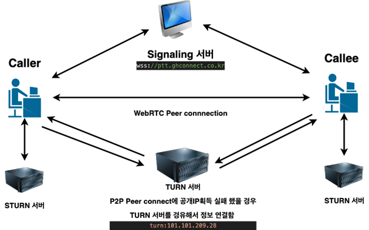

**WebRTC 통신과정**

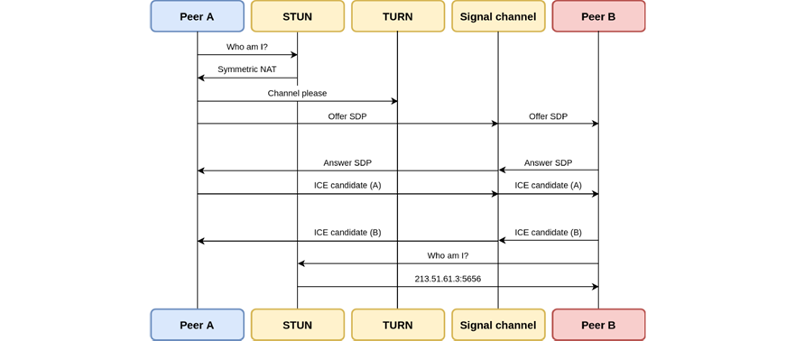

**클라이언트 간 통신구조**

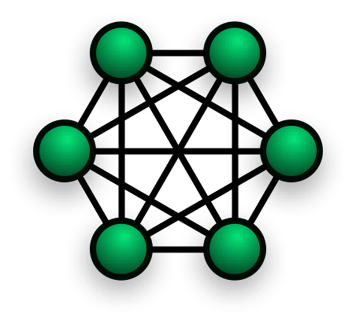

**시그널링 서버코드**

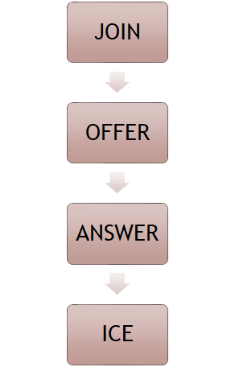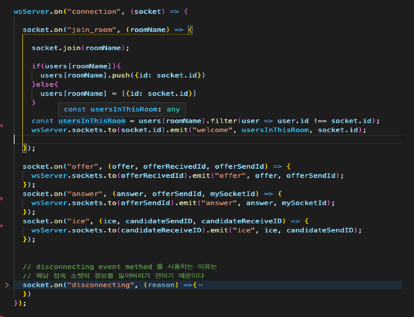

**클라이언트 코드**

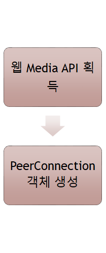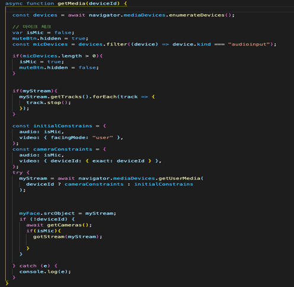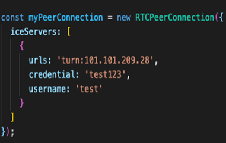

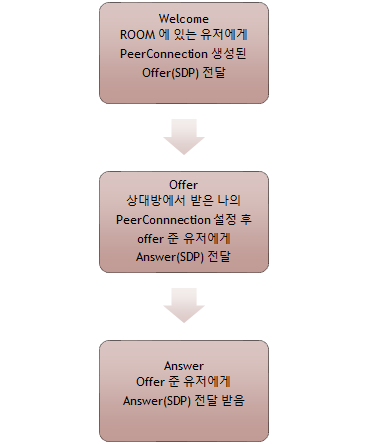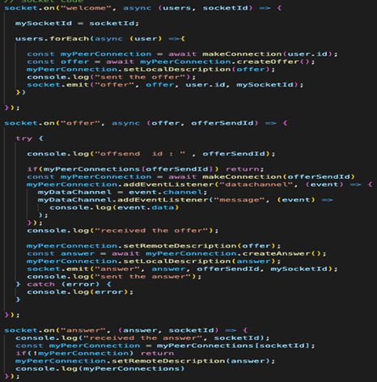

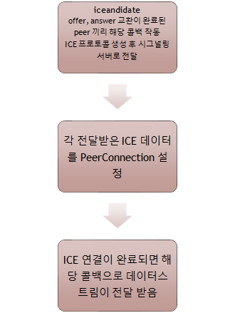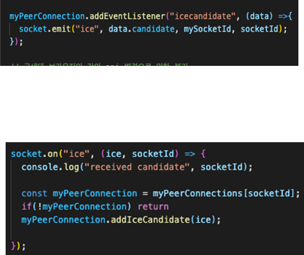
